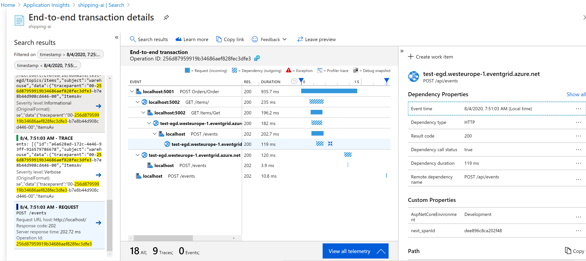

## EventGrid correlation

There are some utilities that add possibility to have correlation between code that emits events and code that handles them.

### In the emitting code

1. Add these two classes:
   
  ```csharp
  public class EventGridDependencyInitializer : ITelemetryInitializer
      {
          public EventGridDependencyInitializer() { }
          public void Initialize(ITelemetry telemetry)
          {
              if (telemetry is DependencyTelemetry)
              {
                  var dependency = (telemetry as DependencyTelemetry);
                  var activity = Activity.Current;
                  var id = activity.GetBaggageItem("next_spanId");
                  if (!string.IsNullOrEmpty(id))
                  {
                      dependency.Id = id;
                  }
              }
          }
      }

      public static class ActivityExtensions
      {
          public static string TraceParent(this Activity activity)
          {
              if (activity?.SpanId == null || activity?.Id == null)return null;

              var nextSpanId = ActivitySpanId.CreateRandom().ToHexString();
              activity.AddBaggage("next_spanId", nextSpanId);

              var currentSpanId = activity.SpanId.ToHexString();
              var traceparent = activity.Id.Replace(currentSpanId, nextSpanId);

              return traceparent;
          }
      }
  ```

2. Configure telemetry initializer:
   
  ```csharp
  services.AddSingleton<ITelemetryInitializer>(new EventGridDependencyInitializer());
  ```

3. Add `traceparent` field to event Data:

  ```csharp
  await eventGrid.PublishEventsAsync(config["EventGrid:Hostname"], new List<EventGridEvent>()
  {
      new EventGridEvent()
      {
          Id = Guid.NewGuid().ToString(),
              Topic = "shipping",
              Data = JObject.FromObject(new
              {
                  traceparent = Activity.Current.TraceParent(),
              }),
              EventType = "ItemShipped",
              Subject = $"shipping",
              DataVersion = "1.0.1"
      }
  });
  ```

### In the event handler

1. Use a generic event handler class:

  ```csharp
  class EventGridHandler
  {
      private readonly ILogger log;

      public EventGridHandler(ILogger<EventGridHandler> log)
      {
          this.log = log;
      }

      public async Task Handle(HttpContext context, Func<EventGridEvent, Task> callback)
      {
          string response = string.Empty;

          using var reader = new StreamReader(context.Request.Body);
          var requestContent = await reader.ReadToEndAsync();
          log.LogDebug($"Received events: {requestContent}");

          EventGridSubscriber eventGridSubscriber = new EventGridSubscriber();

          EventGridEvent[] eventGridEvents = JsonConvert.DeserializeObject<EventGridEvent[]>(requestContent);

          var validationEvent = eventGridEvents.FirstOrDefault(e => e.EventType == "Microsoft.EventGrid.SubscriptionValidationEvent");

          if (validationEvent != null)
          {
              await InActivityContext(context, validationEvent, async () =>
              {
                  var result = HandleValidation(validationEvent);

                  context.Response.ContentType = "application/json";
                  await context.Response.WriteAsync(JsonConvert.SerializeObject(result));
              });
              return;
          }

          foreach (EventGridEvent eventGridEvent in eventGridEvents)
          {
              await InActivityContext(context, eventGridEvent, () => callback(eventGridEvent));
          }

          context.Response.StatusCode = 202;
      }

      private static async Task InActivityContext(HttpContext context, EventGridEvent eventGridEvent, Func<Task> callback)
      {
          Activity requestActivity = new Activity($"EVENT {eventGridEvent.EventType} {eventGridEvent.Subject}");
          requestActivity.SetParentId(GetOperationId(eventGridEvent));
          requestActivity.Start();

          var requestTelemetry = context.Features.Get<RequestTelemetry>();
          var operation = requestTelemetry.Context.Operation;
          
          requestTelemetry.Name = operation.Name;
          operation.Name = requestActivity.OperationName;
          requestTelemetry.Id = requestActivity.SpanId.ToHexString();            
          operation.Id = requestActivity.TraceId.ToHexString();
          operation.ParentId = requestActivity.ParentSpanId.ToHexString();
          
          try
          {
              await callback();
          }
          finally
          {
              requestActivity.Stop();
          }
      }

      private static string GetOperationId(EventGridEvent eventGridEvent)
      {
          string operationId = null;
          try
          {
              if (((JObject)eventGridEvent.Data).TryGetValue("traceparent", out var traceParentValue))
              {
                  operationId = traceParentValue.Value<string>();
              }
          }
          catch
          {
              // ignore
          }
          return operationId;
      }

      private object HandleValidation(EventGridEvent validationEvent)
      {
          var eventData = ((JObject)validationEvent.Data).ToObject<SubscriptionValidationEventData>();
          log.LogInformation($"Got SubscriptionValidation event data, validation code: {eventData.ValidationCode}, topic: {validationEvent.Topic}");
          // Do any additional validation (as required) and then return back the below response

          var responseData = new SubscriptionValidationResponse()
          {
              ValidationResponse = eventData.ValidationCode
          };

          return responseData;
      }
  }
  ```

2. Configure webhook endpoint:

  ```csharp
  app.UseEndpoints(endpoints =>
  {
      endpoints.MapPost("/events", async context =>
      {
          var handler = new EventGridHandler(loggerFactory.CreateLogger<EventGridHandler>());
          await handler.Handle(context, async gridEvent =>
          {
              var logger = loggerFactory.CreateLogger<Startup>();
              logger.LogInformation($"processing grid event: {JsonConvert.SerializeObject(gridEvent)}");
              
              await Task.Yield();
          });
      });
  }
  ```

### Result

Observe end-to-end tracing:



# References

[custom-operations-tracking](https://docs.microsoft.com/en-us/azure/azure-monitor/app/custom-operations-tracking)

