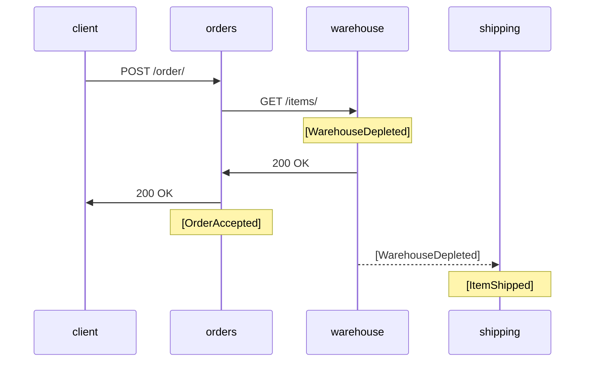

# log-correlation

A toy project to test Application Insights logs correlation.

## How to

[How to add correlation to EventGrid events](HowTo.md)

## This code

#### orders

User-facing service that accepts orders. 

#### warehouse

Backend service that oversees the number of available items.

#### shipping

Ships ordered items.

### Flow

