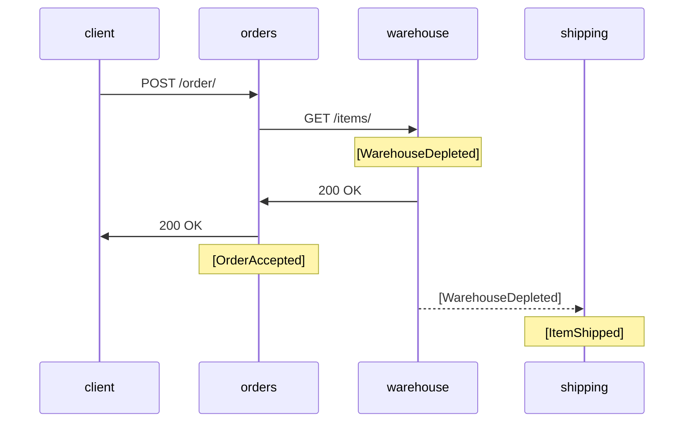
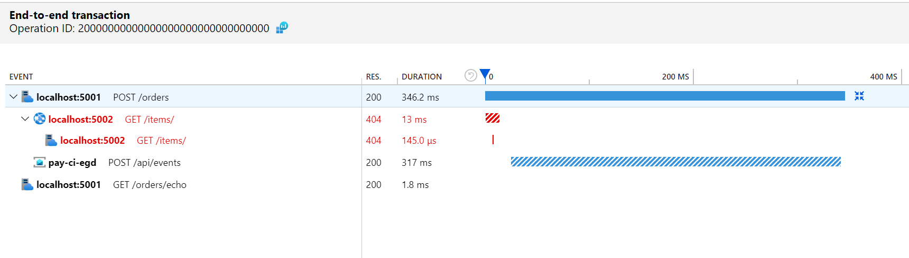
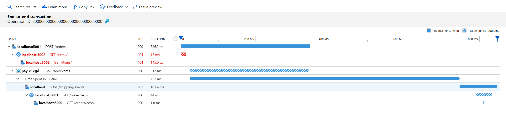

# log-correlation

A toy project to test Application Insights logs correlation.

## How to

[How to add correlation to EventGrid events](HowTo.md)

## This code

#### orders

User-facing service that accepts orders. 

#### warehouse

Backend service that oversees the number of available items.

#### shipping

Ships ordered items.

### Flow

# Notes

When searching app insights for operation id, the first app in chain (orders) shows only event grid dependency.

The shipping app shows event handler call, as well as the source request to orders.

